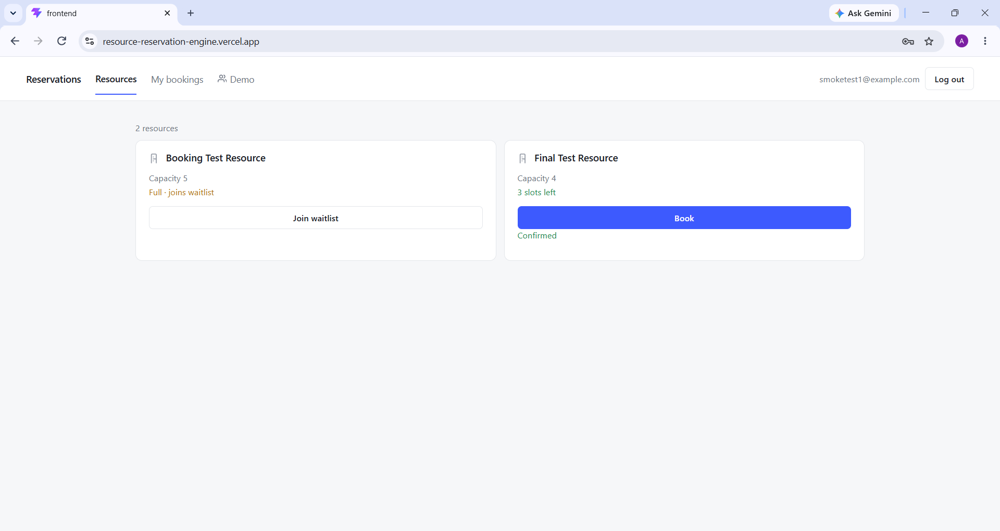
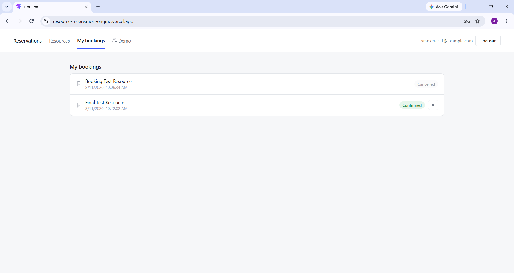
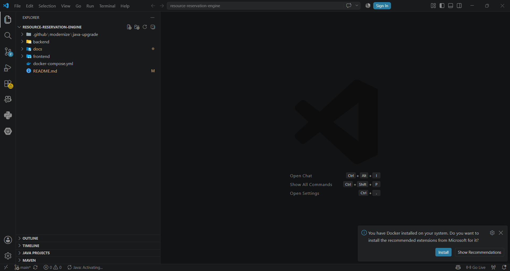
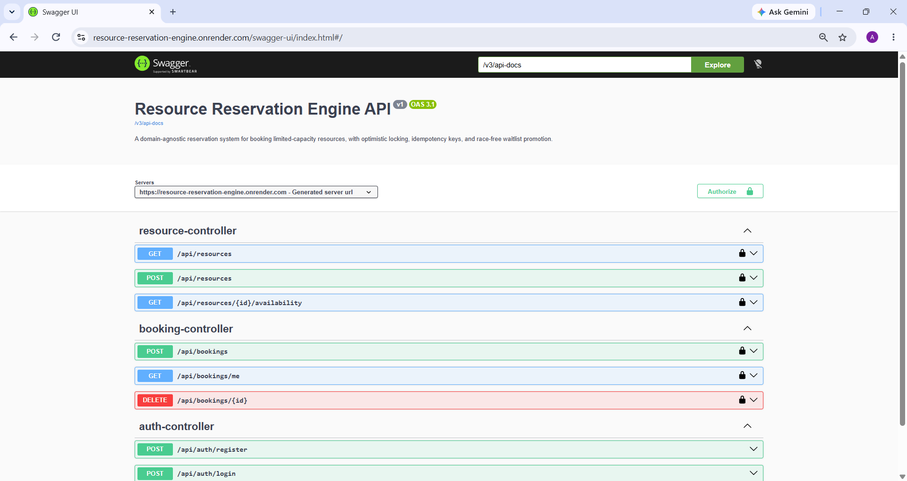

# Resource Reservation Engine with Concurrency Control

A domain-agnostic reservation system for booking any limited-capacity resource — built to
demonstrate correct handling of concurrent access at the database level, rather than papering
over it with application-level locks or hoping traffic never collides. Two clients booking the
last available slot on the same resource at the same instant is the core problem this project
solves, addressed directly through optimistic locking, an availability-aware capped retry on
lost version races, safe retry via idempotency keys, and a race-free waitlist promotion path.

Built with Java 21, Spring Boot 4.1, Spring Security 7, MySQL, and React.

For the reasoning behind the key architectural decisions in this project — optimistic locking
over pessimistic, idempotency key handling, waitlist promotion, and known limitations — see
[`docs/design-decisions.md`](docs/design-decisions.md). Full request/response schemas are
served live via Swagger UI once the application is running, rather than duplicated here.

---

## Table of Contents

- [Screenshots & Live Demo](#screenshots--live-demo)
- [Tech Stack](#tech-stack)
- [Key Features](#key-features)
- [Authentication](#authentication)
- [Resources](#resources)
- [Bookings](#bookings)
- [Frontend](#frontend)
  - [Screens](#screens)
  - [Running the Frontend](#running-the-frontend)
- [Local Development with Docker](#local-development-with-docker)
- [Running Locally](#running-locally)
  - [Prerequisites](#prerequisites)
  - [Environment Variables](#environment-variables)
  - [Steps](#steps)
- [API Documentation](#api-documentation)
- [Concurrency Test Script](#concurrency-test-script)
- [Design Decisions](#design-decisions)
- [Project Structure](#project-structure)

---

## Screenshots & Live Demo


*Resources — one resource full and waitlisted, another successfully booked and confirmed.*



*My Bookings — the caller's own bookings shown in both terminal states, Confirmed and Cancelled.*



*Concurrency Demo — 8 simultaneous booking requests against a capacity-4 resource: 3 Confirmed,
5 Waitlisted, 0 overbooked, with per-request timing.*


*Swagger UI — interactive API documentation for all resource and booking endpoints, with JWT
bearer authentication configured via the Authorize button.*

**Live demo:**
- Backend health check: https://resource-reservation-engine.onrender.com/actuator/health
- App: https://resource-reservation-engine.vercel.app
- Swagger UI: https://resource-reservation-engine.onrender.com/swagger-ui.html

**Demo accounts:** `demo.user1@test.com` through `demo.user8@test.com` — pre-seeded specifically
for the Concurrency Demo panel.

The backend runs on Render's free tier, which spins down after inactivity — the first request
after idle may take 30–60 seconds to respond while the instance wakes up. Subsequent requests
are fast.

---

## Tech Stack

| Layer | Technology |
|---|---|
| Language | Java 21 |
| Framework | Spring Boot 4.1 |
| Security | Spring Security 7 — JWT-based, stateless, method-level authorization via `@PreAuthorize` |
| Persistence | Spring Data JPA, Hibernate, MySQL |
| Frontend | React (Vite), plain JavaScript — no UI, state, or routing libraries |
| API Documentation | springdoc-openapi (Swagger UI) |
| Infrastructure | Docker, Docker Compose, Render, Aiven (MySQL), Vercel |

---

## Key Features

- JWT-based authentication with role-based access (ADMIN / USER) and a seeded admin account
  created automatically on startup
- Idempotency-key deduplication and duplicate-active-booking prevention built into booking
  creation from the start, rather than added as a later hardening pass
- Optimistic locking on a `@Version`-guarded `bookedCount`, with an availability-aware capped
  retry in a fresh transaction on a lost version race — a request only stops retrying on success
  or a fresh read showing the resource genuinely full, never purely because it lost a fixed
  number of races — the cap exists only as a safety net against a runaway loop, not as a
  business rule. Verified under real concurrent load with a standalone Java test script,
  including a scenario with more available seats than contenders where every request correctly
  succeeds.
- Race-free waitlist: capacity-full bookings are waitlisted rather than rejected, cancelling a
  confirmed booking promotes the oldest waitlisted entry in the same transaction, and live
  waitlist position is exposed on bookings — verified under both raced and staggered concurrent
  load
- Interactive API documentation via Swagger UI (springdoc-openapi), with JWT bearer
  authentication scoped to the resource and booking controllers only
- React frontend — five screens (login/register, resources with booking, my bookings,
  concurrency demo) backed by a fetch wrapper that reads the backend's actual error response
  shape (`error`, `fields`, `reason`)
- Full end-to-end regression pass — auth, booking, waitlist promotion, concurrency demo,
  cross-session isolation, error handling — completed against a containerized local MySQL
  instance, covering both the backend API and the React frontend together
- Local MySQL runnable via Docker Compose as an alternative to a native install, on a separate
  port so both can coexist
- Deployed to production: backend on Render (Docker, Oregon region), MySQL on a shared Aiven
  instance with a database-scoped service user isolated from the sibling project sharing that
  instance, frontend on Vercel with `VITE_API_URL` driving the API base URL at build time. Full
  end-to-end smoke test passed against the live deployment, including the concurrency demo
  against real seeded accounts.

---

## Authentication

Authentication is email- and password-based, returning a JWT on login. There are two fixed
roles:

- **ADMIN** — manages resources. Seeded automatically on application startup via a
  `CommandLineRunner`; not created through self-registration.
- **USER** — registers via `/api/auth/register`, can book and cancel their own reservations.

Registration is open to anyone, but always creates a `USER`-role account — any role field in a
registration request is ignored, since the DTO doesn't expose one at all.

Authorization is enforced exclusively through `@PreAuthorize` with `@EnableMethodSecurity` — the
project deliberately uses this as its single access-control pattern throughout, rather than
mixing it with path-matcher-based restrictions in `SecurityConfig`.

### Endpoints (auth)

| Method | Path | Auth required | Description |
|---|---|---|---|
| POST | `/api/auth/register` | No | Create a new USER account |
| POST | `/api/auth/login` | No | Authenticate and receive a JWT |

---

## Resources

- **ADMIN** creates resources (`name`, `capacity`) — via Swagger UI, since this project's
  frontend covers the USER side only.
- Any authenticated user can check a resource's availability.

### Endpoints (resources)

| Method | Path | Auth required | Description |
|---|---|---|---|
| POST | `/api/resources` | ADMIN | Create a new resource |
| GET | `/api/resources/{id}/availability` | Any authenticated user | View a resource's current details |

---

## Bookings

- **USER** books a resource by ID. A booking is one slot — there's no quantity field; booking
  multiple slots means multiple separate booking requests.
- Every booking request must include an `Idempotency-Key` header, generated by the client, so a
  retried request (e.g. after a lost response) doesn't create a duplicate booking.
- A user can hold at most one active booking per resource at a time — this now covers both
  `CONFIRMED` and `WAITLISTED` states, not just `CONFIRMED`. A cancelled booking doesn't count
  against this — a user can rebook (or rejoin the waitlist for) a resource they previously
  cancelled.
- If a resource is at capacity when a booking request arrives, the request still succeeds —
  `POST /api/bookings` returns `201` with `status: WAITLISTED` instead of rejecting the request.
  A `201` no longer means the caller holds a slot; clients must read the `status` field in the
  response body. `waitlistPosition` is included on waitlisted bookings, reflecting the caller's
  place in line at read time.
- If a booking attempt loses a `VERSION_CONFLICT` race (another request wrote to the resource
  first), it is retried automatically in a fresh transaction rather than failing outright. Each
  retry re-checks current availability: if the resource is genuinely full on a fresh read, the
  request is waitlisted; otherwise it retries again, up to a high safety cap. A
  `409 VERSION_CONFLICT` is only ever returned if that safety cap is exhausted — in practice this
  should not happen under normal contention levels.
- Cancelling a `CONFIRMED` booking decrements `bookedCount` and promotes the oldest waitlisted
  booking on that resource to `CONFIRMED`. Both steps use the same fresh-transaction retry as
  booking creation, so a version conflict on either step is retried rather than failing the
  cancellation outright. Cancelling a `WAITLISTED` booking simply removes it from the queue — it
  does not free a slot and triggers no promotion.
- Only the booking's owner can cancel it.

### Endpoints (bookings)

| Method | Path | Auth required | Description |
|---|---|---|---|
| POST | `/api/bookings` | USER | Book a resource (requires `Idempotency-Key` header) |
| DELETE | `/api/bookings/{id}` | Owner only | Cancel a booking |
| GET | `/api/bookings/me` | Any authenticated user | List the caller's own bookings |

Full request/response schemas are available via Swagger UI once the application is running (see
below) — this README intentionally doesn't duplicate that reference.

---

## Frontend

Vite + React, plain JavaScript — no UI component library, no client-side routing library, no
state management library beyond `useState`/`useEffect`. Navigation between Resources, My
Bookings, and the Concurrency Demo is handled via in-app tab state, not a router, since the app
is a single authenticated page with no distinct routes to bookmark.

The frontend covers the USER side only. Resource creation — the only ADMIN operation this
project exposes — is performed directly through Swagger UI rather than a dedicated admin screen,
since building a full admin interface around a single write endpoint wasn't worth the scope for
this project.

JWT and the logged-in user's identity live only in React state at the `App` root — never in
`localStorage` or `sessionStorage` — consistent with this project's practice of keeping nothing
sensitive persisted client-side. No optimistic UI: every booking or cancellation refetches from
the server afterward rather than predicting the outcome client-side, which matters specifically
for a project centered on getting concurrent state right.

### Screens

- **Login / Register** — combined, toggled client-side; login is the default view.
- **Resources** — lists all resources with live `availableSlots`, books or joins a waitlist
  inline, no toast — the result renders directly on the resource's card.
- **My Bookings** — lists the caller's own bookings (`CONFIRMED`, `WAITLISTED`, `CANCELLED`),
  cancel action removed once a booking is already cancelled.
- **Concurrency demo** — logs into 8 fixed seeded accounts
  (`demo.user1@test.com`–`demo.user8@test.com`, registered once beforehand with a shared
  password) and fires their booking requests simultaneously via `Promise.all` against a resource
  selected from a live dropdown, timing each request with `performance.now()`. The panel is
  deliberately restricted to these 8 fixed accounts rather than accepting arbitrary users — this
  is a controlled demonstration of the backend's race handling, not a general load-testing tool,
  so the account set is fixed and known in advance rather than dynamic. Demo-target resources are
  created manually via Swagger before each run rather than through the app, since resource
  creation has no concurrency angle and isn't part of this frontend's scope. The panel
  intentionally does not display the waitlist position returned in each request's immediate
  response — see "Why waitlist position is computed at read time, not stored" in
  [`docs/design-decisions.md`](docs/design-decisions.md) for why that value is unreliable in the
  same instant as the race and settles correctly only on a subsequent read.

### Running the Frontend

```bash
cd frontend
npm install
npm run dev
```

Starts on `http://localhost:5173`. Requires the backend running on `http://localhost:8080` with
CORS configured to allow this origin (see `SecurityConfig`).

---

## Local Development with Docker

MySQL can run either as a native local install or as a Docker container — both are supported,
distinguished by `DB_PORT`.

```bash
docker-compose up -d
```

This starts a MySQL 8.0 container (`reservation-engine-mysql`) on host port `3307`, mapped
internally to MySQL's default `3306`, so it doesn't conflict with a native install running on
`3306`. To point the application at the container, set `DB_PORT=3307`; leaving it unset connects
to a native install on `3306` instead. The container uses a named volume for data persistence
across restarts and has restart policy `no` — it must be started manually each session.

---

## Running Locally

### Prerequisites

- Java 21
- Maven
- MySQL running locally (or update `application.yml` datasource config to point elsewhere)

### Environment Variables

| Variable | Purpose | Default |
|---|---|---|
| `DB_USERNAME` | MySQL username | `root` |
| `DB_PASSWORD` | MySQL password | **Required** — the application will not start without it |
| `DB_PORT` | Port the application connects to MySQL on | `3306` (native install); set to `3307` for the Dockerized instance — see [Local Development with Docker](#local-development-with-docker) |
| `JWT_SECRET` | Signing key for JWTs | **Required**, no default — must be a long random string (min 256 bits) |
| `ADMIN_EMAIL`, `ADMIN_PASSWORD` | Credentials for the seeded admin account | Local-dev defaults; should be overridden before any non-local deployment |

`DB_PASSWORD` and `JWT_SECRET` previously had placeholder defaults committed in
`application.yml`; these were removed after the file was found to be tracked with real values,
and both secrets were rotated as a result.

### Steps

```bash
cd backend
./mvnw spring-boot:run
```

The application starts on `http://localhost:8080`. Swagger UI is available at
`http://localhost:8080/swagger-ui.html`. Protected endpoints can be tested directly from the UI
via the Authorize button using a JWT obtained from `/api/auth/login`.

---

## API Documentation

Live, interactive API documentation is served via Swagger UI directly from the running
application rather than maintained as a separate static reference file — this avoids the two
going out of sync as endpoints change. This README covers architecture, setup, and rationale;
Swagger covers exact request/response shapes.

---

## Concurrency Test Script

`backend/src/main/java/com/project/resource_reservation_engine/scripts/ConcurrencyTest.java` is
a standalone script (plain `HttpClient`, no Spring/JUnit dependency) that fires simultaneous
requests at a running instance of the application to verify race-condition handling — no
overbooking, correct waitlist promotion, and safe concurrent cancellation.

To run it:

1. Start the application locally.
2. Log in as the seeded admin and 5 separate users via `/api/auth/login` (e.g. through Postman)
   to obtain JWTs.
3. In your IDE's run configuration for `ConcurrencyTest`, set these environment variables to the
   tokens obtained above: `CONCURRENCY_TEST_ADMIN_TOKEN`, `CONCURRENCY_TEST_USER_TOKEN_1` through
   `CONCURRENCY_TEST_USER_TOKEN_5`.
4. Run the script. JWTs expire, so these need to be refreshed each session.

---

## Design Decisions

See [`docs/design-decisions.md`](docs/design-decisions.md) for the reasoning behind key
architectural choices — optimistic locking over pessimistic, idempotency key handling, waitlist
promotion, and known limitations.

---

## Project Structure

```
resource-reservation-engine/
├── .github/
├── backend/                  # Spring Boot application
├── docs/
│   ├── design-decisions.md
│   └── screenshots/
├── frontend/                  # React app (Vite + React)
├── docker-compose.yml         # Local MySQL container
└── README.md
```
